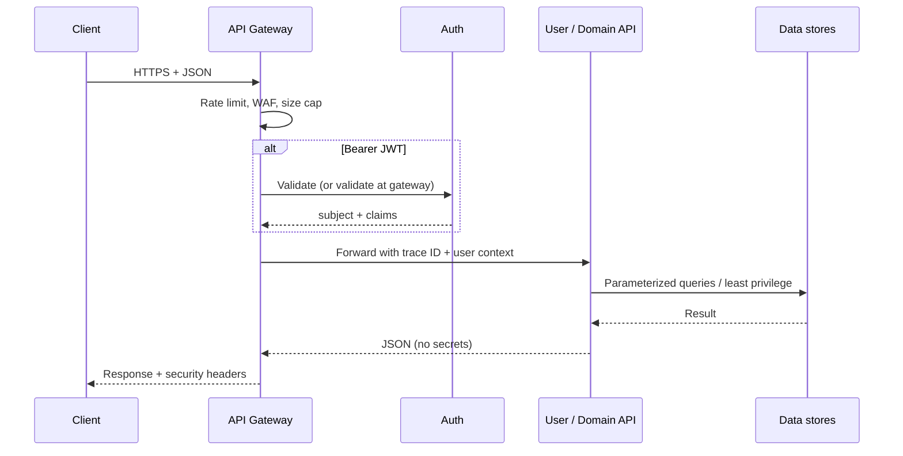

# CCWEB backend security architecture

This document describes the **target production architecture** and how the **current monolith** maps into it. CCWEB today ships as a Node HTTP server (`server.js`) with mounted **Express** sub-apps (`auth/`, `developerExpress.js`, `intelligenceExpress.js`). Scaling means extracting these boundaries behind an API gateway without changing contracts abruptly.

---

## 1. High-level architecture (text diagram)

```
                                    ┌─────────────────────────────────────┐
                                    │           CDN / WAF (optional)       │
                                    │  DDoS edge, bot score, TLS offload   │
                                    └──────────────────┬──────────────────┘
                                                       │ HTTPS
                                                       ▼
┌──────────────────────────────────────────────────────────────────────────────┐
│                         API GATEWAY (Kong / Envoy / AWS ALB)                  │
│  • TLS termination (if not at CDN)   • Global rate limits                    │
│  • Request size limits               • Auth passthrough (JWT validation optional)│
│  • Routing / canary                • mTLS for internal east-west (optional)    │
└───────────────┬───────────────────────────────┬──────────────────────────────┘
                │                               │
                ▼                               ▼
    ┌───────────────────────┐       ┌───────────────────────────┐
    │     AUTH SERVICE       │       │    PUBLIC / DEV API      │
    │  JWT, refresh, 2FA     │       │  /v1 (API keys),         │
    │  Wallet SIWE           │       │  /api/developer (lock  │
    │  Session revocation    │       │   behind gateway auth)   │
    └───────────┬─────────────┘       └─────────────┬────────────┘
                │                                   │
                └───────────────┬───────────────────┘
                                ▼
              ┌─────────────────────────────────────────────┐
              │              USER SERVICE                    │
              │  Profiles, roles, consent, PII minimization │
              │  RBAC / ABAC policies                      │
              └─────────────────────┬───────────────────────┘
                                    │
        ┌───────────────────────────┼───────────────────────────┐
        ▼                           ▼                           ▼
┌───────────────┐          ┌─────────────────┐          ┌──────────────────┐
│ AGENT SERVICE │          │ PAYMENT SERVICE │          │ WORKFLOW ENGINE  │
│ AI tool calls │          │ Ledger, payouts │          │ Queues, idempot. │
│ Sandboxed exec│          │ PCI scope isolate│         │ Secrets inject   │
└───────┬───────┘          └────────┬────────┘          └────────┬─────────┘
        │                           │                          │
        └───────────────────────────┴──────────────────────────┘
                                    ▼
              ┌─────────────────────────────────────────────┐
              │   DATA PLANE (PostgreSQL + Redis + object S3) │
              │   Encryption at rest, least-privilege IAM    │
              └─────────────────────┬──────────────────────────┘
                                    ▼
              ┌─────────────────────────────────────────────┐
              │  LOGGING / MONITORING / SIEM / AUDIT TRAIL     │
              │  OpenTelemetry → Loki/ELK, alerts, fraud rules │
              └─────────────────────────────────────────────┘
```

---

## 2. Request flow (API → services)



**Current repo:** Gateway behaviors are partially implemented as **Helmet + CORS allowlist** on Express apps (`security/expressHardDefaults.js`), **per-route rate limits** (`auth/rateLimit.js`, developer API key limits), and **raw `server.js`** routes for legacy features.

---

## 3. Logical folder structure (target vs current)

| Layer | Target (microservices) | Current (this repo) |
|-------|-------------------------|------------------------|
| Gateway | `infra/gateway/` IaC | ALB / Cloudflare — configure outside repo |
| Auth | `services/auth/` | `auth/*` |
| User | `services/user/` | `ccwebUsers` map + `buildUserProfile` in `server.js` |
| Intelligence / Find | `services/intelligence/` | `intelligenceExpress.js`, `cryptoSafety.js`, … |
| Developer platform | `services/developer/` | `developerExpress.js`, `developerPlatform.js` |
| Security shared | `packages/security/` | `security/` (Express defaults, sanitize helpers) |
| Docs | `docs/` | `docs/BACKEND_SECURITY_ARCHITECTURE.md` (this file) |

---

## 4. Security controls (by concern)

### Users & sessions

- **Passwords:** bcrypt (see `auth/authEngine.js`).
- **Sessions:** JWT access + rotating refresh (hashed at rest); httpOnly cookie + optional body refresh for SPA dev (`docs/AUTH_API.md`).
- **2FA:** TOTP + backup codes; secrets encrypted (`auth/cryptoSecret.js`).
- **Wallet auth:** Nonce + signature verification only — **never** private keys.

### Data

- **MongoDB / Postgres:** use **parameterized** drivers; never string-concatenate user input into queries.
- **PII:** minimize stored fields; encrypt columns (KMS envelope) for tax IDs, etc.
- **RBAC:** API keys carry roles (`developerExpress.js`); app users carry `roles` on profile.

### Transactions & payments

- **Idempotency keys** on deploy / payments (already used in DApp flow).
- **PCI:** keep card data out of CCWEB servers; use Stripe/payment provider hosted fields.

### AI & automation

- **Tool allowlists** per agent; no arbitrary shell from LLM output.
- **Human-in-the-loop** for high-risk actions (payouts, contract deploy to mainnet).
- **Prompt injection:** treat model I/O as untrusted; log redacted prompts for audit.

### DDoS & abuse

- **Edge:** WAF + bot management (Cloudflare, AWS WAF).
- **App:** rate limits (login, wallet, developer API); extend with Redis sliding windows per IP+user.
- **IP denylist:** maintain in gateway or Redis; block ASNs known for abuse during attacks.

### Logging & monitoring

- **Structured logs:** JSON with `requestId`, `userId` (hashed if needed), `route`, `latency`, `status`.
- **Audit trail:** admin actions, permission changes, payout approvals — append-only store.
- **Alerts:** 5xx rate, auth anomaly (credential stuffing), sudden traffic spikes.

### Backups

- **DB:** automated snapshots (RDS PITR / Mongo Atlas continuous backup).
- **Object storage:** versioned buckets for user uploads.
- **Restore drills:** quarterly test restore to staging.

### Deployment

- **Secrets:** AWS Secrets Manager / GCP Secret Manager / Vault — **not** `.env` in images.
- **TLS:** enforce HTTPS; HSTS at gateway.
- **Headers:** Helmet on Express apps (`security/expressHardDefaults.js`).

---

## 5. CORS & Helmet (implemented)

- **`CCWEB_ALLOWED_ORIGINS`** — comma-separated browser origins (e.g. `https://app.ccweb.io,https://www.ccweb.io`). Defaults include local Vite + API ports for development.
- **`TRUST_PROXY=1`** — set when behind a reverse proxy so `X-Forwarded-For` is trusted **only** at the proxy boundary.

---

## 6. Production security checklist

Use this before go-live:

- [ ] `AUTH_JWT_SECRET` ≥ 32 bytes random; rotated on compromise procedure documented.
- [ ] `NODE_ENV=production`; TLS termination + HSTS at load balancer.
- [ ] `CCWEB_ALLOWED_ORIGINS` locked to real frontends; no `*` with credentials.
- [ ] MongoDB / Postgres with **TLS**, **IP allowlist**, least-privilege DB user.
- [ ] Developer console `/api/developer/*` **behind** auth or disabled in prod.
- [ ] Rate limits backed by **Redis** for multi-instance consistency.
- [ ] Centralized logging + retention policy + PII scrubbing in logs.
- [ ] Dependency scanning (npm audit, Snyk) in CI.
- [ ] SAST/DAST in CI for OWASP Top 10 coverage.
- [ ] Incident runbook (key rotation, user notification, forensic snapshot).

---

## 7. SQL/NoSQL injection

- Use **ORM/query builders** with bound parameters.
- Validate all IDs with strict regex (e.g. Ethereum address checks already in developer flows).
- Never pass user strings into `$where` / raw aggregation pipelines without escaping.

---

## 8. Scaling path

1. Stand up **API gateway** with same public paths.
2. Move `auth/` to dedicated service; keep JWT issuer URL stable.
3. Move `developerExpress` + `developerPlatform` to **Developer BFF** with service auth to core.
4. Split `server.js` domain routes into **User**, **Streaming**, **Commerce** services.
5. Add **message bus** (Kafka/SQS) for workflows and agent tasks.

This document is the **source of truth** for security architecture reviews; implementation PRs should link here when they change boundaries or controls.
