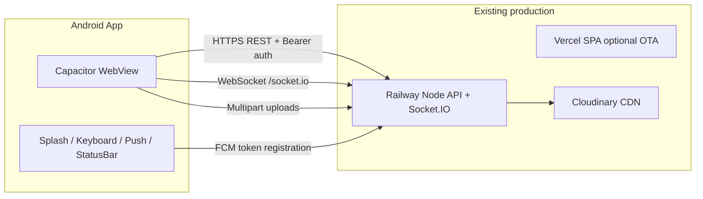

# CCWEB Mobile App Deployment (Capacitor Android)

This guide covers building and shipping the CCWEB Vite SPA as an installable **Android** app via [Capacitor 7](https://capacitorjs.com/). The web app continues to deploy to **Vercel**; the API stays on **Railway** — the native shell loads the built `dist/` bundle and talks to the same production API.

## Architecture



| Layer | Location | Notes |
|-------|----------|-------|
| UI bundle | `dist/` copied into `android/app/src/main/assets/public` | Built with `VITE_API_BASE_URL` pointing at Railway |
| Native shell | `android/` Gradle project | App ID: `io.chrisccweb.app` |
| API | `https://ccweb-api-production-a92c.up.railway.app` | Unchanged; CORS + cookies + Bearer JWT |
| Realtime | Socket.IO on Railway | `websocket` + `polling` transports |
| Push (FCM) | `@capacitor/push-notifications` | Requires `google-services.json` |

## Prerequisites

- **Node.js 20.x** and npm ≥ 10
- **Java JDK 17+** (JDK 21 recommended)
- **Android Studio** (Ladybug or newer) with:
  - Android SDK Platform 35 (or project `compileSdk`)
  - Android SDK Build-Tools
  - Android SDK Command-line Tools
- Environment variable: `ANDROID_HOME` or `ANDROID_SDK_ROOT` pointing at your SDK

## Quick start (local)

```bash
# 1. Install dependencies
npm ci

# 2. Production build pinned to Railway API + sync into Android
npm run mobile:sync

# 3. Generate CCWEB Foundation adaptive icons + splash (source: assets/brand/ccweb-foundation-logo.svg)
npm run mobile:assets
npm run mobile:sync

# 4. Open in Android Studio
npm run mobile:open
```

Debug APK:

```bash
npm run mobile:android:debug
# Output: android/app/build/outputs/apk/debug/app-debug.apk
```

Release APK / AAB (requires signing keystore — see below):

```bash
npm run mobile:android:release
```

## Environment / API configuration

Mobile builds **must** target the Railway API (not Vercel origin):

```bash
VITE_API_BASE_URL=https://ccweb-api-production-a92c.up.railway.app npm run build
```

The `mobile:build` script sets this automatically. Production guard in `src/config/env.js` also falls back to the canonical Railway URL when the bundle is served from `capacitor://` or `https://localhost`.

### Auth & session persistence

- Web: tokens in `sessionStorage`
- **Capacitor native**: tokens in `localStorage` via `src/lib/authStorage.js` so sessions survive app restarts
- Refresh flow unchanged: `/api/auth/refresh` + Bearer on `/api/auth/me`

### Realtime (Socket.IO)

- Client uses `getApiBaseUrl()` — connects directly to Railway in native builds
- App resume reconnect: `ccweb:app-resume` from `@capacitor/app` + existing visibility/online handlers

### Cloudinary / file uploads

- Uploads use `XMLHttpRequest` multipart (`src/api/uploadsApi.js`) — compatible with Android WebView
- Permissions in `AndroidManifest.xml`: `READ_MEDIA_IMAGES`, legacy storage, `CAMERA`
- `FileProvider` configured for camera/gallery pickers

### Service worker

- PWA service worker registration is **skipped** on native (`src/lib/registerServiceWorker.js`)
- Install prompt hidden in Capacitor shell

## Firebase Cloud Messaging (FCM)

Push is **architecture-ready** but requires your Firebase project:

1. Create a Firebase project → add Android app with package `io.chrisccweb.app`
2. Download `google-services.json` → place at `android/app/google-services.json` (gitignored)
3. Rebuild — Gradle applies `com.google.gms.google-services` when the file exists
4. On first launch, `initNativePushNotifications()` requests permission and registers the device token
5. Token POST: `POST /api/v1/notifications/device-token` (stored in `notification_prefs.nativePush`)

See `android/app/google-services.json.example` for placement.

## Release signing

1. Generate keystore:

```bash
keytool -genkey -v -keystore ccweb-release.keystore -alias ccweb -keyalg RSA -keysize 2048 -validity 10000
```

2. Create `android/keystore.properties` (gitignored):

```properties
storeFile=../ccweb-release.keystore
storePassword=***
keyAlias=ccweb
keyPassword=***
```

3. Wire signing in `android/app/build.gradle` (Android Studio: **Build → Generate Signed Bundle** is the simplest path for first release).

4. Play Console: upload **AAB**, set `versionCode` / `versionName` in `android/app/build.gradle`.

## CI verification commands

```bash
npm run verify:imports
npm test
npm run build
npm run mobile:sync
cd android && ./gradlew assembleDebug
```

## Troubleshooting

| Issue | Fix |
|-------|-----|
| Blank WebView | Run `npm run mobile:sync` after every web change |
| API 401 / wrong host | Rebuild with `mobile:build`; check Logcat for `[ccweb-api-debug]` when `VITE_CCWEB_API_DEBUG=1` |
| Upload fails | Grant photos/camera permission; confirm Railway `DATABASE_URL` + Cloudinary env on API |
| Socket disconnects on background | Expected — app reconnects on resume via `initRealtimeLifecycle` |
| Push never registers | Add `google-services.json`; confirm POST_NOTIFICATIONS granted on Android 13+ |
| Gradle SDK errors | Set `ANDROID_HOME`, install SDK Platform matching `compileSdk` in `variables.gradle` |

---

## Android deployment QA checklist

Use this before each store or internal release.

### Build & packaging

- [ ] `npm run verify:imports` passes
- [ ] `npm test` passes
- [ ] `npm run build` passes
- [ ] `npm run mobile:sync` completes without errors
- [ ] `./gradlew assembleDebug` (or `assembleRelease`) succeeds
- [ ] App ID remains `io.chrisccweb.app`
- [ ] `versionCode` / `versionName` bumped for store submission

### Cold start & shell

- [ ] Splash screen shows CCWEB branding then hides smoothly
- [ ] Status bar is dark, content respects safe-area (notch / gesture nav)
- [ ] Android back button navigates in-app; minimizes when no history
- [ ] No PWA “Install CCWEB” banner on native

### Auth & session

- [ ] Sign up / sign in against production Railway API
- [ ] Kill app process → relaunch → still signed in (localStorage persistence)
- [ ] Logout clears session and disconnects Socket.IO
- [ ] Token refresh works after ~15+ minutes (or forced 401)

### Core flows (mobile-first UX)

- [ ] Home / dashboard loads
- [ ] Community feed scroll + compose post
- [ ] Chat: send text + image upload
- [ ] Learn: course catalog + lesson progress
- [ ] Profile: avatar/banner upload (Cloudinary path)
- [ ] Notifications center opens; badge updates

### Network & realtime

- [ ] REST calls hit `ccweb-api-production-a92c.up.railway.app` (not Vercel)
- [ ] Chat/community realtime updates without manual refresh
- [ ] Background app → foreground: socket reconnects within ~5s
- [ ] Airplane mode toggle: offline banner / graceful errors

### Keyboard & layout

- [ ] Chat composer stays above keyboard
- [ ] AI tutor / community reply inputs not obscured
- [ ] No double scroll or layout jump when keyboard opens/closes

### Push (when FCM configured)

- [ ] Notification permission prompt appears once
- [ ] `POST /api/v1/notifications/device-token` returns 200
- [ ] Test FCM message received (foreground + tap action)
- [ ] Preferences reflect `nativePush.enabled: true`

### Permissions & uploads

- [ ] Photo picker works for profile avatar
- [ ] Camera capture works (if enabled in UI)
- [ ] Large images rejected with friendly error (413 / client limit)

### Security

- [ ] No cleartext HTTP traffic
- [ ] `google-services.json` and keystore **not** committed
- [ ] WebView debugging disabled in release builds

### Store readiness (optional)

- [ ] Signed AAB uploaded to Play Console internal track
- [ ] Privacy policy URL listed (photos, notifications)
- [ ] Play Data Safety form matches API + FCM usage

---

## Related files

| File | Purpose |
|------|---------|
| `capacitor.config.json` | App ID, splash, keyboard, push plugin defaults |
| `src/lib/capacitorPlatform.js` | Native init, status bar, back button |
| `src/lib/authStorage.js` | Persistent auth on native |
| `src/lib/nativePush.js` | FCM registration + API hook |
| `scripts/generate-capacitor-assets.mjs` | Launcher icons + splash PNGs |
| `android/app/src/main/AndroidManifest.xml` | Permissions + WebView config |
