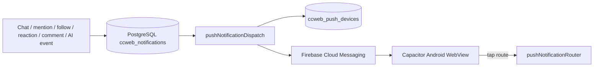

# CCWEB Push Notification Setup (FCM + Capacitor Android)

Production native push uses **Firebase Cloud Messaging (FCM)** on the Railway API and **Capacitor Push Notifications** in the Android shell. No simulated or fake push — if FCM is not configured, delivery is skipped and logged as `skipped` with reason `fcm_not_configured`.

## Architecture



| Component | Path |
|-----------|------|
| FCM sender | `services/fcmPush.js` |
| Category + prefs gate | `services/pushNotificationDispatch.js` |
| Token storage (encrypted) | `db/persistencePushDevices.js` |
| Delivery log | `db/persistencePushDelivery.js` |
| Client registration | `src/lib/nativePush.js` |
| Tap routing | `src/lib/pushNotificationRouter.js`, `src/hooks/useNativePushRouting.js` |

## Push categories

| Category | Triggers |
|----------|----------|
| `messages` | DM / chat messages |
| `mentions` | `@mention` in community |
| `follows` | New follower |
| `reactions` | Likes, reposts |
| `comments` | Post replies |
| `aiAlerts` | Learning milestones, AI tutor, build/stream events |

Users control each category under **Notifications → Notification preferences → Mobile push (FCM)**.

## Firebase setup

### 1. Firebase project

1. [Firebase Console](https://console.firebase.google.com/) → Add project (or use existing).
2. Add **Android app** with package name `io.chrisccweb.app`.
3. Download `google-services.json` → `android/app/google-services.json` (gitignored).

### 2. Service account (Railway)

1. Firebase → Project settings → **Service accounts** → Generate new private key.
2. On Railway, set:

```bash
FIREBASE_SERVICE_ACCOUNT_JSON={"type":"service_account","project_id":"...",...}
```

(minified single-line JSON)

### 3. Token encryption (recommended)

Generate a 32-byte key and set on Railway:

```bash
openssl rand -hex 32
# → PUSH_TOKEN_ENCRYPTION_KEY=<64-char-hex>
```

Without this key, tokens are stored in PostgreSQL as plaintext (still not exposed via API).

### 4. Migrate database

Migration `014_push_devices.sql` runs automatically on Railway boot (`npm start` → `migrate()`).

Manual: `npm run db:migrate`

## API endpoints

| Method | Path | Purpose |
|--------|------|---------|
| `POST` | `/api/v1/notifications/device-token` | Register / refresh FCM token |
| `DELETE` | `/api/v1/notifications/device-token` | Revoke token (logout) |
| `GET` | `/api/v1/notifications/push/diagnostics` | Devices + 24h delivery summary |
| `PUT` | `/api/v1/notifications/preferences` | Category toggles |

## Client behavior

- **Registration**: `initNativePushNotifications()` on app boot (`src/main.jsx`).
- **Token refresh**: `registration` listener + `ccweb:app-resume` → re-register with API.
- **Foreground**: toast via `useNativePushRouting` + badge refresh.
- **Background**: system tray notification; tap → deep link route in payload.
- **Logout**: `revokeNativeDeviceToken()` clears server-side token.

## Local verification

```bash
npm run verify:imports
npm test
npm run build
npm run mobile:sync
cd android && ./gradlew assembleDebug
```

With Firebase configured on a device/emulator with Google Play services:

1. Sign in on debug APK.
2. Grant notification permission.
3. Confirm `POST /device-token` returns 200 and `fcmConfigured: true`.
4. Trigger a DM from another account → push received.
5. Kill app → send another message → background notification.
6. Tap notification → opens `/messages?highlight=…`.
7. Kill app → relaunch → still signed in; token re-registered (`last_seen_at` updated).

---

## Android push QA checklist

### Build & config

- [ ] `google-services.json` present locally (not committed)
- [ ] `FIREBASE_SERVICE_ACCOUNT_JSON` set on Railway
- [ ] `PUSH_TOKEN_ENCRYPTION_KEY` set on Railway (recommended)
- [ ] Migration 014 applied (`ccweb_push_devices`, `ccweb_push_delivery_log`)
- [ ] `./gradlew assembleDebug` succeeds
- [ ] Notification channel `ccweb_alerts` created (MainActivity)

### Registration & persistence

- [ ] Permission prompt on first launch (Android 13+)
- [ ] `POST /device-token` returns 200 with `stored: true`
- [ ] `GET /push/diagnostics` lists active device
- [ ] Kill app → relaunch → token re-registered (`last_seen_at` updates)
- [ ] Logout → `DELETE /device-token` revokes token
- [ ] Sign in again → new registration succeeds

### Foreground notifications

- [ ] App open → incoming DM shows toast + badge updates
- [ ] Socket/in-app notification list updates without manual refresh
- [ ] Category disabled in prefs → no push (delivery log `skipped`)

### Background notifications

- [ ] App backgrounded → push appears in system tray
- [ ] Sound/vibration on high-priority channel
- [ ] Multiple devices: each receives push (up to 20 tokens/user)

### Tap routing

- [ ] Message tap → `/messages?highlight=<chatId>`
- [ ] Mention/reaction/comment → `/community`
- [ ] Follow → `/profile`
- [ ] AI alert → `/ai-tutor` or `/learn`

### Categories (prefs)

- [ ] Toggle off `messages` → DMs do not push
- [ ] Toggle off `mentions` → mentions do not push
- [ ] Toggle off `follows` → follow events do not push
- [ ] Toggle off `reactions` → likes/reposts do not push
- [ ] Toggle off `comments` → replies do not push
- [ ] Toggle off `aiAlerts` → learning/AI events do not push
- [ ] Master `nativePush.enabled: false` → all skipped

### Diagnostics & failure handling

- [ ] `GET /push/diagnostics` shows 24h sent/failed/skipped counts
- [ ] Invalid FCM token revoked automatically on `registration-token-not-registered`
- [ ] Railway logs show `fcm_initialized` on boot when configured
- [ ] Without FCM env → no crash; deliveries logged as `skipped` / `fcm_not_configured`

### Security

- [ ] Raw FCM tokens never returned from API (only device metadata)
- [ ] `google-services.json` and service account JSON not in git
- [ ] Push only sent to authenticated user's registered devices

---

## Troubleshooting

| Symptom | Fix |
|---------|-----|
| No push, `fcm_not_configured` | Set `FIREBASE_SERVICE_ACCOUNT_JSON` on Railway; redeploy |
| No push, `no_devices` | Open app signed-in; check permission granted |
| No push, `native_push_disabled` | Enable in Notifications preferences |
| Token not persisting | Confirm `DATABASE_URL` + migration 014 |
| Tap opens wrong screen | Verify `data.route` in FCM payload (server `buildPushRoute`) |
| Gradle missing google-services | Add `google-services.json`; rebuild |

## Related docs

- [MOBILE_APP_DEPLOYMENT.md](./MOBILE_APP_DEPLOYMENT.md) — Capacitor Android shell
- `.env.example` — `FIREBASE_SERVICE_ACCOUNT_JSON`, `PUSH_TOKEN_ENCRYPTION_KEY`
